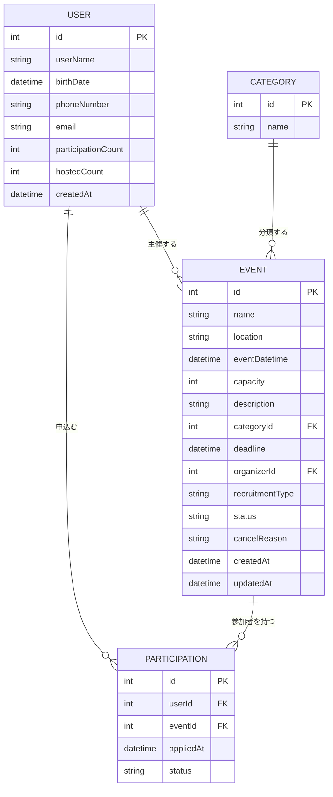

# イベント管理アプリ ER図

```mermaid
erDiagram
    USER ||--o{ EVENT : "主催する"
    USER ||--o{ PARTICIPATION : "申込む"
    EVENT ||--o{ PARTICIPATION : "参加者を持つ"
    CATEGORY ||--o{ EVENT : "分類する"

    USER {
        int id PK
        string userName
        datetime birthDate
        string phoneNumber
        string email
        int participationCount
        int hostedCount
        datetime createdAt
    }

    EVENT {
        int id PK
        string name
        string location
        datetime eventDatetime
        int capacity
        string description
        int categoryId FK
        datetime deadline
        int organizerId FK
        string recruitmentType
        string status
        string cancelReason
        datetime createdAt
        datetime updatedAt
    }

    PARTICIPATION {
        int id PK
        int userId FK
        int eventId FK
        datetime appliedAt
        string status
    }

    CATEGORY {
        int id PK
        string name
    }
```